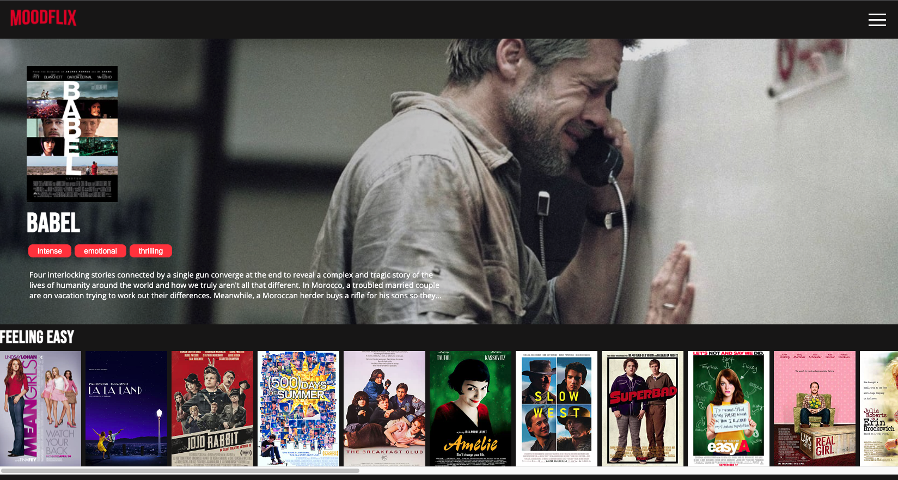
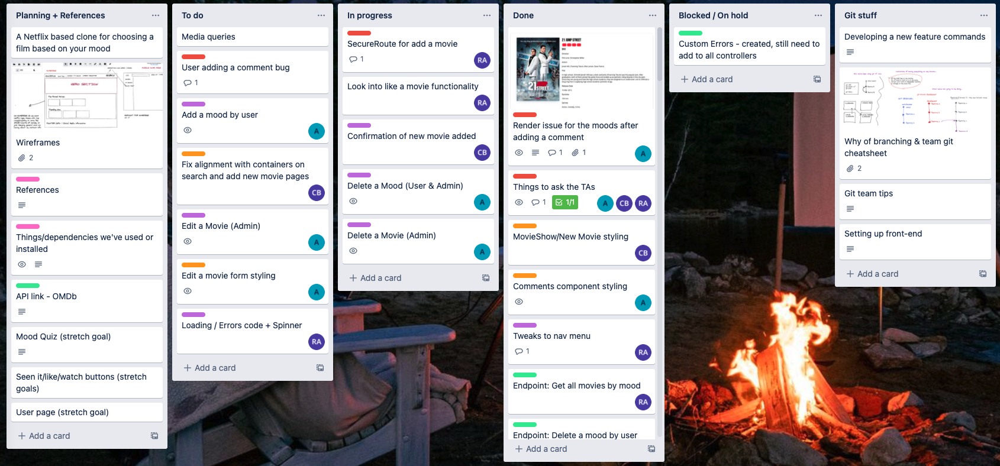
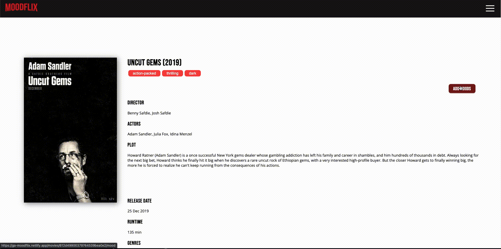
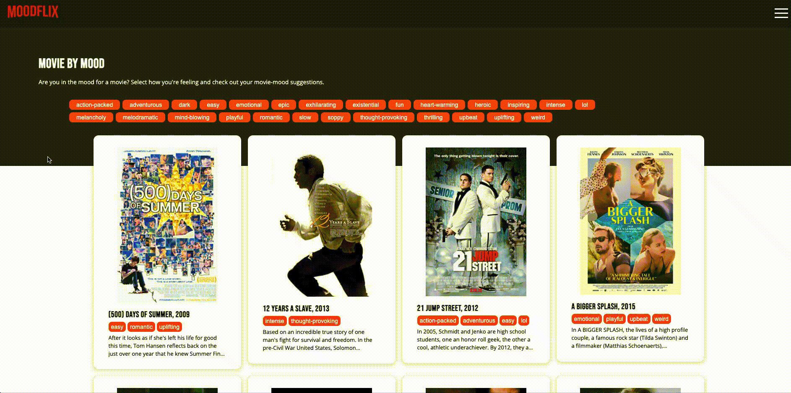
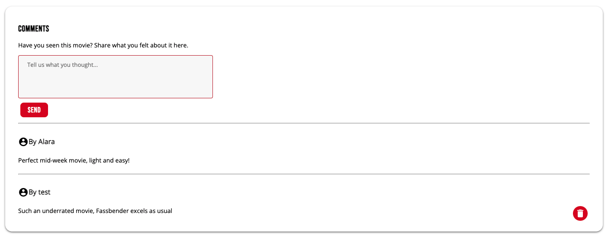

#   Project-3: Moodflix 

#### General Assembly SEI Project-3 | Moodflix | Full-stack MERN app | 10-day sprint | 3-person team

Deployed version of our app: - https://ga-moodflix.netlify.app/ 

To access all of the features you can login with the following credentials:

**email:** admin@email.com **password:** password


<p>

</p>

## Overview 
This was our second to last project at General Assembly's Software Engineering Immersive Course. As a group we were tasked with building a full-stack application of our choice.

Inspired by the amount of time we spend on Netflix trying to find something to watch, only to choose something out of frustration in the end and get disappointed, we decided sometimes indexing movies based on their genre was just not enough. And Moodflix was born. Moodflix is centered around choosing movies based on your current mood. 

To access the frontend repository please [click here.](https://github.com/alaraayan/sei-project-3-frontend)

## Collaborators

* Chloe Brown - [@chloebuilds](https://github.com/chloebuilds)
* Rizwan Akhtar - [@rizwanakhtar7](https://github.com/rizwanakhtar7)


## Brief
The brief given was to:
* **Build a full-stack application** - by making your own backend and your own front-end.
* **Use an Express API** to serve your data from the Mongo database.
* **Consume your API with a separate front-end** built with React.
* **Be a complete product** which most likely means multiple relationships and CRUD functionality for at least a couple of models.
* **Implement thoughtful user stories/wireframes** that are significant enough to help you know which features are core MVP and which you can cut.
* **Have a visually impressive design**. 
* **Be deployed online** so it's publicly accessible.

## Techonologies Used
**Frontend**
- HTML5
- CSS3 and Sass
- React.js
- JavaScript(ES6)
- Dependencies installed: react-router-dom, react-select, react-toastify, react-loader-spinner, hamburger-react
- [TMDB API](https://api.themoviedb.org/)

**Backend**
- Mongoose
- MongoDB
- Express
- Node.js
- [OMDb API](http://www.omdbapi.com/)

**Dev Tools**
- Git
- GitHub
- Google Chrome dev tools
- VScode
- ESlint

## Process

#### Planning
Our group worked well from the get-go, we each had strengths that complimented one another. We first planned all the features we wanted Moodflix to have, decided on which were stretch goals and which were must-haves. We then tackled the backend and only once we were all finished with our backend tasks, we moved on to the frontend. We made the decision to mainly stick to the same features and work on similar tasks on both the backend and the frontend. For example, I handled user endpoints in the backend and then worked on the register and login components in the frontend. Having a Trello board to keep things organised also worked very well for us. 

###### Our Trello board:

<hr>

We started every day with a mini group standup, stayed on Zoom for the rest of the day to help each other when needed and took breaks at the same time together to have a synced rhythm. At the end of each day we merged our Git branches and went over the Trello board, setting and assigning tasks for the next day. These little practices helped us stay on top of who was doing what and created an environment where we were autonomous enough to work on our own and still collaborated as a one unit team.

#### Backend
Before moving on to the frontend, we wanted to make sure everything was working as we planned in the backend. We divided up the tasks and tested regularly after merging our branches together. 

I was in charge of the user model and handled the register and login endpoints. As we had two types of users -admin and general- I also handled user related functionalities such as adding, deleting and editing movies and moods. Our user model looked like this:

```javascript
const userSchema = new mongoose.Schema({
  username: { type: String, required: true, unique: true },
  email: { type: String, required: true, unique: true },
  password: { type: String, required: true },
  isAdmin: { type: String, default: false, required: true },
})
```

Every movie we seeded was assigned to the admin user. We wanted to have control over the content on Moodflix and limited a user's abilities accordingly. Logged in users can add a movie to the database, leave a comment on a movie, add moods to an existing movie and only delete the moods they've added. Editing and deleting movies are only allowed for admin users who also have the ability to edit moods regardless who has originally added them.  

We handled a lot of these in the frontend but made sure we added the necessary validations in the backend as well. For example, the authorisation part of removing a comment looks like this:

``` javascript
async function remove(req,res, next) {
  try {
    const isAdmin = req.currentUser.isAdmin

    if (req.currentUser._id.equals(comment.user) || isAdmin === 'true'){
      comment.remove()
      await movie.save()
      return res.sendStatus(204)
    }
    res.status(401).send({ message: 'Unauthorized' })
  } catch (e) {
    next(e)
  }
}
```
#### Frontend
After completing our backend we moved on to the frontend as a group. Continuing with the general areas we handled in the backend, we each chose our components. Since I handled users in the backend, I took user related functionalities which were register and login, comments, movie show page, editing a movie and adding/removing moods from an existing movie. I had to make sure every type of user was seeing content relevant to them.

Being more comfortable with React since the last project, I took advantage of breaking things down to components and conditionally rendering the JSX depending a user's status. 

While everyone on a movie's show page saw its information, admin users had the ability to edit and remove the movie like this:

``` javascript
{isLoggedIn && isAdmin() && (
  <>
    <div>
      <div className="buttons-container">
        <Link
          to={`/movies/${movie._id}/edit`}>
          <button className="submit-button">
            <span className="material-icons">
              edit
            </span>Edit Movie
          </button>
        </Link>
          <button onClick={handleDeleteMovie} className="submit-button">
            <span className="material-icons">
            delete
            </span>Delete Movie
          </button>
      </div>
    </div>
  </>
)}
```
Modeled after Netflix, Moodflix's styling choices were relatively easy. We kept the things we liked as users of Netflix and changed the ones we didn't. For example, the movie show page doesn't have a dark theme as we wanted to keep this part of the site light.

## Screenshots
###### The hero component shows a different movie each time:


###### Logged in user adds moods to an existing movie:


###### Admin user edits a movie:


###### User filters movies by their moods:


## Challenges
The biggest challenge I had was figuring out how to manage changing the moods -adding and removing- of an existing movie. Initially I thought this functionality would be just like comments and handled the backend with ease. However, because we were fetching our data from an external API and then seeding with the added moods and we needed to know which user added which mood to which movie, this proved to be a tricky task once we took the project full stack.

In terms of UX, I wanted a mood to be moved from one section to the other once selected and first achieved this by pushing all newly selected moods to a new array. This allowed me to be able to add all the moods to the movie once the form was submitted. 

Removing the moods was a different set of challenge. Because a user could add three moods to a movie and then go back, remove two of them and add four more all at once. I had to find a way to handle all of these events in one form submission. 

The eureka moment came when I realised just because the user was clicking a button to submit the new moods, I didn't have to submit them then and there. This changed my entire perspective on the problem and the end result was much cleaner code where the new and updated movie moods are submitted each and every time the user clicks on a mood. The button that used to submit the moods is now only there for UX purposes, it has no actual functionality.

###### A mood is added to the movie as soon as the user clicks on it:
``` javascript
  const handleAddingMoods = async e => {
    try {
      const moodToAdd = e.target.value
      setCurrentMoods([...currentMoods, moodToAdd])
      const newMoodId = allMoods.find(currentMood => currentMood.mood === moodToAdd)._id
      await addNewMood(movieId, newMoodId)
      const movieWithNewMoods = await getSingleMovie(movieId)
      setMovie(movieWithNewMoods.data)
    } catch (e) {
      console.log(e)
    }
  }
```
###### The user's moods are deleted as soon as they are clicked on:
``` javascript
  const handleRemovingMoods = async e => {
    try {
      const moodNameToRemove = e.target.value
      const updatedCurrentMoods = currentMoods.filter(mood => mood !== moodNameToRemove)
      const moodToRemoveId = movie.moods.filter(currentMood => currentMood.mood.mood === moodNameToRemove ).map(moodInfo => moodInfo._id)
      await deleteMood(movieId, moodToRemoveId)
      setCurrentMoods(updatedCurrentMoods)
    } catch (e) {
      console.log(e)
    }
  }  
```

## Wins
This project for me was filled with many wins. We put a lot of effort in the user experience of this project, whether it was using icons wherever possible, having clear error messages or automatically logging in a user after registration. As users of the internet we all had good and bad experiences with websites and we worked hard to make sure that's not the case with Moodflix. We wanted it to be enjoyable to use and I believe we have achieved that. 

As a user I don't like it when I'm not logged in after registering and wanted to make sure that's not the case for Moodflix. 


``` javascript
function Register() {
    try {
      await registerUser(formData)
      const loginForm = {
        email: formData.email,
        password: formData.password,
      }
      const res = await loginUser(loginForm)
      setToken(res.data.token)
      setIsAdmin(res.data.isAdmin)
      toast.error('Successfully registered! Welcome to Moodflix.')
      history.push('/movies')
    } catch (e) {
      setError(e.response.data.message)
    }
  }
```
Another UX related win for me was the comments, I am really proud of the way they look and function. A relatively small but important win. 



``` javascript
{movie.comments.slice(0).reverse().map((comment) => {
  return <section key={comment._id} >
    <hr></hr>
    <div className="comments-container">
      <div>
        <h4><span className="material-icons by">
          account_circle
        </span> By {comment.user.username}</h4>
        <p>{comment.text}</p>
      </div>
      <div className="delete-comment-container">
        {isLoggedIn && (isAdmin() || isOwner(comment.user._id)) &&
          <button 
            onClick={() => handleDeleteComment(comment._id)} className="delete-comment">
            <span className="material-icons">
              delete
            </span>
          </button>
        }
      </div> 
    </div>
  </section>
})}
```
## Key Learnings
<p>One of the biggest takeaways I have from this project is how important communication and collaboration is when working in a team. We worked really well together and I believe it made the entire week so much more enjoyable. 

We always knew what everyone was doing and although we worked solo most of the time, we checked in with each other regularly and made sure we spent most of the day on Zoom to create a collaborative environment. This helped us when we had problems, we would ask for help a lot sooner. We would start in the morning with a mini standup and finish every day with setting up tasks for everyone. This project was also the first time we used Git branching and to minimise the issues that may arise we always merged together -we affectionately called these Merge Parties-. 

Another crucial aspect I believe was the planning. Chloe has experience working as a project manager and that helped tremendously to keep things organised with tools like Trello. This was the first GA project where I learnt how to work on different branches and resolve merge conflicts together using Git.

But the biggest lesson I learned during this project is to not be afraid to alter my code. I realised, intrinsically I tend to alter my code rather than take a step back and rethink my approach. The moods and editing a movie functionality really taught me how to check with myself whether I need a new angle or not and I find this incredibly valuable.</p>

## Future Features

If we had more time on this project we would add:
- Responsiveness
- Ability for a user to like a movie / add a movie to watchlist
- A profile page for the user

