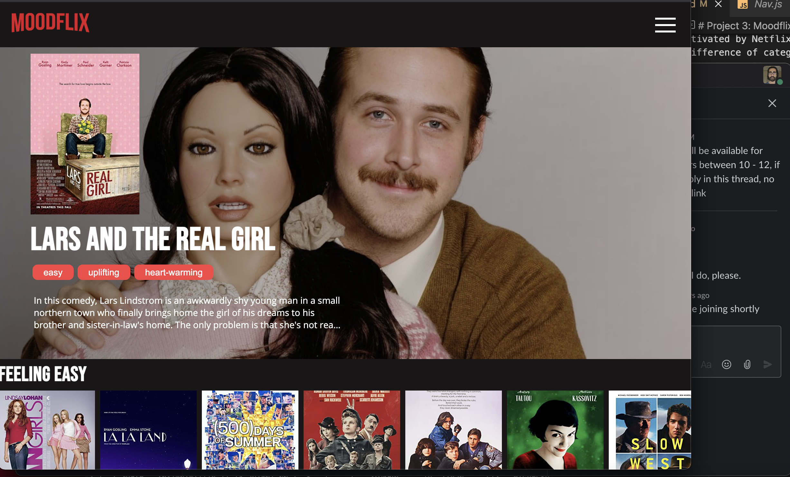
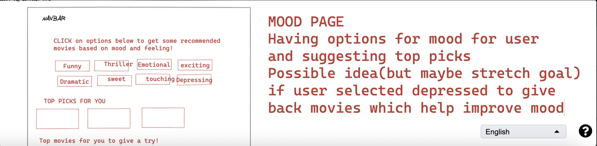
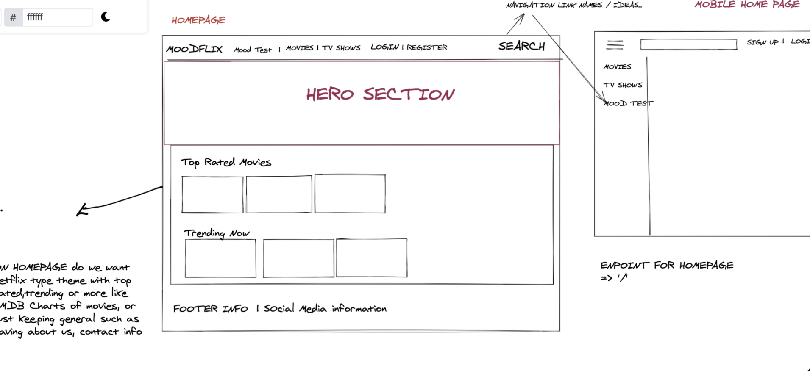

# Project 3: Moodflix 

## Overview 
This was the second to last project at General Assembly's Software Engineering Immersive Course. We were given a week to create a full-stack application with 
Express API to serve data from Mongo database. For the front-end we used React.

As a group of three, we decided to build a Moodflix application, a website to display movies (motivated by Netflix design) but with the difference of categorizing them into moods. Additionally giving users who register the ability to add moods to each movie and search according to mood.

Our Deployed Version link: - https://moodflix-site.netlify.app/ 


<p>

</p>


link to front-end [click here](https://github.com/rizwanakhtar7/project-3-client)


## Brief
The brief given was to :

- **Build a full-stack application** - by making your own backend and your own front-end.
* **Use an Express API** to serve your data from the Mongo database.
* **Consume your API with a separate front-end** built with React.
* **Be a complete product** which most likely means multiple relationships and CRUD functionality for at least a couple of models.
* **Implement thoughtful user stories/wireframes** that are significant enough to help you know which features are core MVP and which you can cut.
* **Have a visually impressive design** 
* **Be deployed online** so it's publicly accessible.

## Techonologies Used
- HTML5
- CSS3
- React
- JavaScript(ES6)
- Mongoose
- MongoDB
- Express
- Node
- Git
- GitHub
- Google Chrome dev tools
- VScode
- ESlint

 ## Approach
 - **Wireframes / Mockups**
 As part of our sign off process, we had to talk through our wireframes,  models for users, moods, movies and their relations in the database tables accordingly.

Inspired by Netflix, we created the name 'Moodflix' to incoorporate our own idea into the app.

We created our models together and seeded the movies using mongoose. Once completed, using trello we managed our tasks for both the backend and frontend.

I was working on:
- SecureRoute to make sure users with the correct roles can access certain components.
- Navbar / SideNav.
- Error page Styling - 404 & unauthorized components.
- Movie Index component.
- Endpoint - getting all movies by mood and controller to handle logic for this.
- Loading / Spinner functionality with error codes.
- Filtering movies by mood.

Alara was working on:
- Edit a movie as Admin.
- Edit movie form styling.
- Adding and Deleting a mood.
- Log in/Register page styling and component.
- Deleting movie as Admin.
- Token Authentication.
- Movie details page.

Chloe was working on:
- Home Component and Hero Component.
- Confirmation of new movie added.
- Styling for components on different pages, button, search styling.
- Validation errors.
- Search Component.
- Adding film.

Although we had our responsibilities, we would still be willing to help each other for any urgent bugs and when each of us was stuck.





### Building the Back-end 
We began our application by working on the models for the users, movies and moods and how they would interact with each other. Additionally understanding how we would get the data back as JSON and use this to add our moods was another challenge we had to reflect on.

We created all the necessary fields for movies such as:

```  imdb: { type: String, required: false, unique: true, validate: [validator, 'Please add the IMDb ID']  },
  title: { type: String, required: true, unique: true, validate: [validator, 'Please add the movie title']  },
  year: { type: String, required: true, validate: [validator, 'Please add the release year']  },
  rated: { type: String, required: true, validate: [validator, 'Please add the rating']  },
  released: { type: String, required: true, validate: [validator, 'Please add the release date']  },
  runtime: { type: String, required: true, validate: [validator, 'Please add the running time']  },
  genres: {  type: String, required: true, validate: [validator, 'Please add at least one genre'] },
  director: { type: String, required: true, validate: [validator, 'Please add the director']  },
  actors: { type: String, required: true, validate: [validator, 'Please add the cast']  },
  plot: { type: String, required: true, validate: [validator, 'Please add the plot']  },
  language: { type: String, required: true, validate: [validator, 'Please add the language of the movie']  },
  poster: { type: String, required: true, validate: [validator, 'Please add the URL for the movie poster']  },
  ```

Additionally we added moods, ratings and comments as reference and embedded schemas:

```
ratings: { type: [ratingsSchema], required: true, validate: [validator, 'Please make sure ratings are added'] },
  moods: { type: [movieMoodSchema], required: true, validate: [validator, 'Please add your moods for this movie'] },
  comments: { type: [commentSchema], required: false },
```

Testing the endpoints was crucial before jumping onto the frontend.
I worked on implementing the movies index endpoint , all movie by moods making sure this bought back the correct data. Chloe worked on the search, post moods/movies routes and Alara on the register, login routes along with the comment routes and deleting movies, moods. Great team dynamics and time-management enabled us to move swiftly through the complex backend and work on it in smaller, manageable steps. Also we had great organisation making sure we were getting up to date and resolving our merge conflicts on git 3 times a day. One in the morning when we met, one at lunch and one before leaving for the day.

```
async function showMoviesByMood(req, res, next) {
  try {
    const matchedMood = await Mood.findOne( { _id: req.params.moodId })
    const getMoviesByMood = await Movie.find( { 'moods.mood': matchedMood })
    res.status(201).json(getMoviesByMood)
  } catch (e) {
    next(e)
  }
}
```

```
async function index(req, res, next) {
  try {
    const moviesList = await Movie.find().populate('moods.mood').populate('user')
    res.status(200).json(moviesList)
  } catch (e) {
    next(e)
  }
}
```

Followed by adding this to the router.js file to ensure the request was hooked up to the correct url parameters:

```
// * Get all moods
router.route('/moods')
  .get(moodController.index)
```

```
// ! Movie routes
// * Get movies, add a movie 
router.route('/movies')
  .get(movieController.index)
  .post(secureRoute, movieController.create)
```


### Building the front-end 
When we moved onto the front-end, I worked on the navbar and sidenav using react hooks along with authentication to make sure only admins can view adding a movie component pages and correctly rendering logging out when on the navbar when logged in. I used conditional rendering to achieve this :

```
  <div className={sidebarShow ? 'side-nav-menu-container active' : 'side-nav-menu-container'}>
        <ul className="navbar-content-container" onClick={handleSideBar}>
          <li><Link to="/" className="navbar-item" ><FontAwesomeIcon className="fa-items-icon" icon={faHome} />Home</Link></li>
          <li><Link to="/movies" className="navbar-item"><FontAwesomeIcon className="fa-items-icon" icon={faFilm} />Movies</Link></li>
          <li><Link to="/movies/search" className="navbar-item"><FontAwesomeIcon className="fa-items-icon" icon={faSearch} />Search Movies</Link></li>

          {isLoggedIn && <li><Link to="/movies/new" className="navbar-item"><FontAwesomeIcon className="fa-items-icon" icon={faPlus} />Add a Movie</Link></li>}
          {!isLoggedIn ?
            <>
              <li><Link to="/register" className="navbar-item"><FontAwesomeIcon className="fa-items-icon" icon={faUserPlus} />Register</Link></li>
              <li><Link to="/login" className="navbar-item"><FontAwesomeIcon className="fa-items-icon" icon={faUsers} />Log In</Link></li>
            </>
            :
            <>
              <li className="navbar-item logout-link" onClick={handleLogout}><FontAwesomeIcon className="fa-items-icon" icon={faSignOutAlt} />Log out</li>
              <ToastContainer />
            </>
          }
        </ul>
        
      </div>
      ```

      The isLoggedIn will return a boolean, when this is true it will display Links to new movies to adding new movies and Logout links. 

  

    After completing this I moved onto the movies index - I displayed the movies on the page using useState and useEffect to make an axios request and display movies accordingly

    ```
    React.useEffect(() => {
    const getMovieData = async () => {
      try {
        const { data } = await getAllMovies()
        setMovies(data)
      } catch (err) {
        setIsError(true)
      }
    }
    setTimeout(getMovieData, 1000)
  }, [])

```
Then I created a filter function which would manipulate the array of movies to display the correct moods according to the button clicked :

```
const filteredMovies = movies?.filter(movie => {
    if (!selectedMoods.length) {
      return true
    } 
    console.log(selectedMoods)
    return selectedMoods.every(selectedMood => movie.moods.map(m => m.mood.mood).includes(selectedMood))
  }).sort(sortingFunctions.alphabetical)
  
  ```
  I used a map and filtered array methods to correctly apply the filter functionality so when a user clicked on for example 'lol' category, movies associated with this mood would be displayed according to this.

  ```
    <div className="movies-container">
            {filteredMovies.map(movie => <MovieCard key={movie._id} {...movie} /> )}
          </div>

  ```

I also had alot of fun implementing the unauthorized and 404 error pages which would display random quotes accordingly when the user accidentally landed on one of these pages.

To do this I created a quotes array with the movies and characters accordingly. Then I created a function which would generate a random quote from the array and then I rendered this using the JSX to display on the page:

```
const quotes = [
    [{ moviename: 'Jaws', character: 'Martin Brody', quote: '\'You\'re gonna need a bigger boat\'' }],
    [{ moviename: 'The Wizard of Oz', character: 'Dorothy Gale', quote: '\'Toto, I\'ve got a feeling we\'re not in Kansas anymore\'' }],
    [{ moviename: 'Apollo 13', character: 'Jim Lovell', quote: '\'Houston, we have a problem\'' }],
    [{ moviename: 'Forrest Gump', character: 'Forrest', quote: '\'Mama always said life was like a box of chocolates. You never know what you\'re gonna get\'' }],
    [{ moviename: 'A Few Good Men', character: 'Col. Nathan R. Jessup', quote: '\'You can\'t handle the truth!\'' }],
    [{ moviename: 'Dirty Dancing', character: 'Johnny Castle', quote: '\'Nobody puts Baby in a corner\'' }],
    [{ moviename: 'Se7en (1995)', character: 'Detective David Mills', quote: '\'What\'s on the page?!\'' }],
    [{ moviename: 'Fight Club (1999)', character: 'The Narrator', quote: '\'I am Jack\'s missing page\'' }],
    [{ moviename: 'Star Wars: Episode IV - A New Hope', character: 'Obi-Wan Kenobi', quote: '\'This is not the webpage you\'re looking for.\'' }]
  ]
  const randomQuote = quotes[Math.floor(Math.random() * quotes.length)]

  ```

  This made the website alot more interactive, and a fun experience for the user.

  Alara was working on the comments functionality along with login, register, adding moods functionality and individual movies page and styling.

  Chloe worked on the home and hero components, search functionality, adding a movie to the database along with the styling for this.


### Wins and Challenges
I had alot of fun developing this project and learnt a great deal about full-stack development. I become comfortable with models in mongoose, seeding data, creating and testing endpoints to manipulate data and most importantly we had amazing team dynamics which allowed us to sail through the tasks. Although we had alot of trouble with the backend as it was interacting alot of moving parts, we jumped on together as a team to resolve any bugs and help each other when faced with diffculty.
In terms of frontend I became comfortable consuming requests from the backend, understanding how to manipulate different array methods to display data as required. 


### Stretch Goals
Although we successfully reached MVP we had some stretch goals we wanted to implement such as :

- Mood Quiz - quiz the user about how they feel and list movies according to what users enter in form or if we found a mood such as depressed / down, to  flip it to positive for the user by listing funny comedies for example.

- I wanted to also try to implement a playlist of favourite movies in relation to each user. They would be able to select there favorite movie and create a playlist accordingly. Also a seen movie button in the front-end to personalise it for each user.

### Key Learnings 
- This was the first GA project where I learnt how to work on different branches and resolve merge conflicts together using Git.

- Learnt how both the front-end and back-end connected together and how they talk to each other.

- Working in a team and making sure targets are met daily.

- Using map and filter array methods to render data required in the frontend from the backend. 

### Bugs
No Bugs found during testing 

